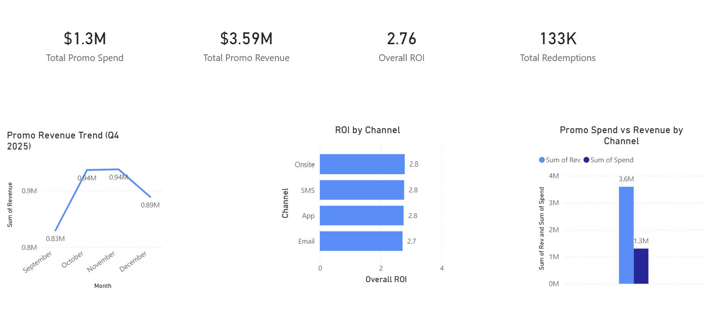

# 📈 Project 2 — Promotional Effectiveness Analysis

---

## Executive Overview

This project analyzes promotional marketing performance across multiple casino properties using Python, SQL, PostgreSQL, and Power BI.

An end-to-end analytics workflow was developed to validate promotional data, evaluate marketing return on investment (ROI), identify the highest-performing channels, and provide executive recommendations for improving promotional spend.

The project demonstrates a complete analytics process from data generation and validation to business reporting and actionable marketing insights.

---

## Business Problem

Marketing departments invest significant promotional budgets across multiple channels but often lack visibility into which campaigns generate the strongest return.

Without accurate ROI reporting, promotional spending can become inefficient, resulting in missed revenue opportunities and poor budget allocation.

This project builds a repeatable promotional analytics process that validates marketing data before delivering executive reporting.

---

## Business Questions

This analysis answers several key business questions:

- Which marketing channels generate the highest ROI?
- Which campaigns produce the strongest promotional revenue?
- Which promotional channels underperform?
- Are promotional reporting dates complete?
- How can promotional budgets be optimized?

---

## Dashboard KPIs

The executive dashboard tracks:

- Total Promotional Spend
- Total Promotional Revenue
- Overall ROI
- Total Redemptions
- ROI by Channel
- Promotional Revenue Trend
- Promotional Spend vs Revenue

---

## Executive Summary

After validating promotional data, I developed an executive Power BI dashboard that measures marketing efficiency across multiple promotional channels.

The analysis identified Mobile App and Onsite campaigns as the highest-performing channels while Email campaigns consistently generated the lowest ROI.

Missing promotional reporting days were detected and validated before dashboard development to improve reporting accuracy.

With clean data, leadership can confidently evaluate marketing performance, prioritize promotional investments, and monitor campaign effectiveness over time.

---

## Marketing Performance Insights

Analysis of promotional activity revealed several key findings.

- Mobile App and Onsite campaigns generated the highest ROI.
- Email campaigns consistently produced the lowest return.
- Promotional spend remained closely aligned with promotional revenue.
- Promotional revenue remained relatively stable throughout Q4.
- Marketing performance varied significantly by channel.

These findings provide management with clear opportunities to optimize future promotional spending.

---

## Data Validation Findings

Several data quality issues were identified prior to analysis.

Validation included:

- Missing promotional date detection
- Promotional revenue verification
- Campaign reporting validation
- Executive summary table creation

Validation Results:

- 245 missing promotional reporting days detected
- Promotional dataset successfully validated
- Executive reporting tables generated

---

## Business Recommendations

Based on the analysis, the following recommendations were identified:

- Increase investment toward Mobile App campaigns.
- Continue prioritizing Onsite promotions.
- Reevaluate Email marketing strategy.
- Implement recurring promotional data validation.
- Continue monitoring marketing ROI through executive dashboards.

---

## Financial Impact Estimate

Budget reallocation scenarios demonstrated measurable opportunities for improving promotional performance.

Estimated revenue improvement:

| Budget Reallocation | Estimated Additional Revenue |
|--------------------|-----------------------------:|
| 25% | +$5,539 |
| 50% | +$11,078 |
| 75% | +$16,617 |

Strategic reallocation toward higher-performing channels could significantly improve promotional ROI without increasing total marketing spend.

---

## Technical Workflow

This project followed the same structured analytics workflow used throughout the portfolio.

Raw Marketing Data

↓

Python Data Generation & Validation

↓

SQL Business Analysis

↓

Power BI Executive Dashboard

↓

Business Recommendations

---

## Tools Used

- Python
- PostgreSQL
- SQL
- Power BI Desktop
- DAX
- Power Query
- Git
- GitHub

---

## Deliverables

- Python promotional dataset generation
- Promotional data validation
- SQL marketing analysis
- Executive Power BI dashboard
- ROI analysis
- Budget optimization recommendations