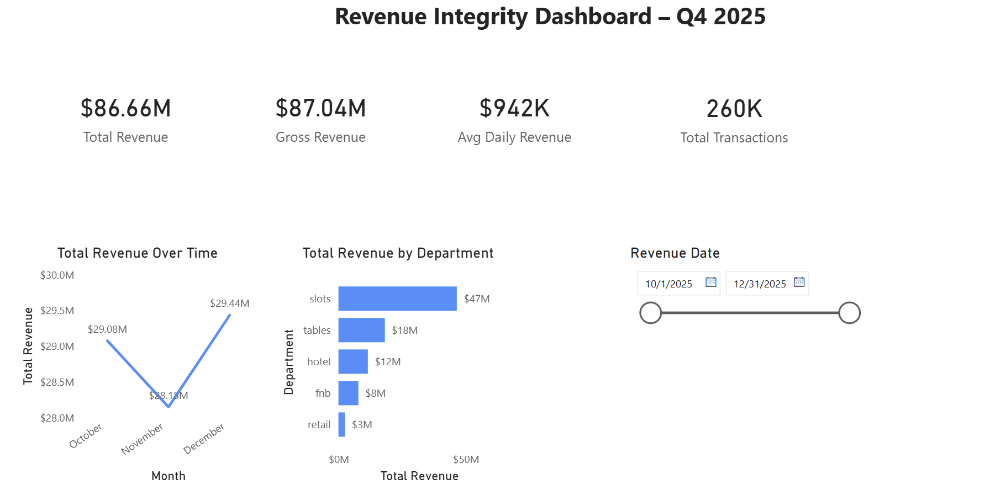

# Problem 02 — Promotional Effectiveness Analysis
## 📊 Power BI Dashboard

## Business Objective

Marketing leadership needs to evaluate whether promotional spending is being allocated
effectively across channels and campaigns.

This analysis supports decisions on:

- Budget reallocation
- Channel prioritization
- Campaign optimization
- Revenue growth strategy

# Promo Effectiveness Analysis

## 📌 Project Overview
This project analyzes casino promotional campaigns to evaluate marketing effectiveness across channels, campaigns, and properties.

The goal is to understand:
- Which campaigns generate the highest return
- Which channels perform best
- How budget reallocation could improve ROI

This analysis simulates real-world marketing performance data and applies SQL-based analytics to support business decision making.

---

## 📊 Dataset Description
Source data contains daily promotional activity with the following fields:

- promo_date
- property
- campaign
- channel
- promo_spend
- promo_revenue
- redemptions

The dataset includes intentional data quality issues such as missing days and inconsistent entries to simulate real operational environments.

---

## ⚙️ Tools & Technologies
- PostgreSQL
- DBeaver
- SQL (CTEs, Aggregations, Joins)
- Python (Data Generation)
- GitHub (Version Control)

---

## 🧹 Data Preparation & Quality Checks

### Missing Date Validation
A calendar table was generated using `generate_series` to identify missing promotional days.

Result:
- 245 missing promo days detected

### Row Validation
Row counts and date ranges were verified to ensure data integrity before analysis.

---

## 📈 Promo Performance Summary

Promotional performance was summarized by:

- Property
- Campaign
- Channel

Metrics calculated:
- Total Spend
- Total Revenue
- ROI
- Average Redemptions

A summary table (`p2_promo_summary`) was created to support performance evaluation.

---

## 🏆 Channel Performance Analysis

Channel-level performance:

| Channel | ROI |
|---------|-----|
| App     | 2.79 |
| Onsite  | 2.79 |
| SMS     | 2.77 |
| Email   | 2.71 |

Mobile App and Onsite campaigns delivered the highest returns.

---

## 💡 Budget Reallocation Simulation

A reallocation model was built to test shifting spend from lower-performing channels to higher-performing ones.

Scenarios tested:

| Reallocation % | Projected Gain ($) |
|---------------|--------------------|
| 25%           | 5,538.96           |
| 50%           | 11,077.91          |
| 75%           | 16,616.87          |

Increasing investment in top-performing channels shows strong potential
for incremental revenue gains.

---

## 📌 Key Takeaways

- App and Onsite channels consistently deliver the highest ROI
- Campaign performance varies significantly by channel
- Missing promotional days indicate operational data gaps
- Strategic budget shifts could increase revenue by up to $16K+

This analysis demonstrates the ability to translate raw promotional data
into actionable business insights.

### 💡 Budget Reallocation Analysis

Reallocation scenarios were modeled to evaluate shifting budget from lower-performing channels to higher-performing ones.

Key findings:

- Onsite had the highest ROI (2.79)
- Email had the lowest ROI (2.72)
- Reallocating 25–50% of spend from Email toward Onsite improved overall efficiency

Example scenario:

- 25% reallocation: ~$78K–$88K per channel
- 50% reallocation: ~$155K–$175K per channel

This model demonstrates how performance-driven budget shifts can improve marketing ROI without increasing total spend.

## 📌 Dashboard Insights (Power BI)

The Power BI dashboard highlights key patterns in promotional performance across Q4 2025.

Key observations include:

- App and Onsite channels generated the highest overall ROI, indicating strong return on promotional spend.
- Promotional revenue peaked in October and November, followed by a slight decline in December.
- Promo spend and revenue remain closely aligned across channels, suggesting efficient budget allocation.
- Email campaigns consistently underperformed relative to other channels, indicating potential optimization opportunities.

These insights support data-driven decisions around channel prioritization and future promotional investments.

