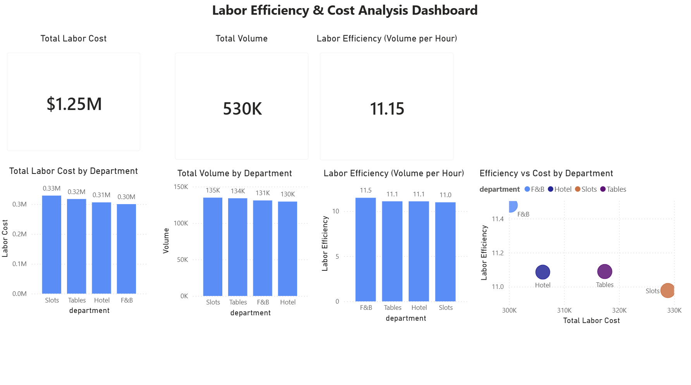
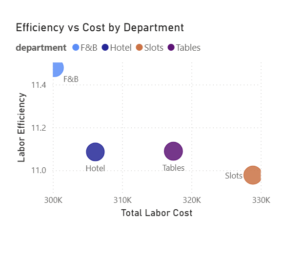

# 📊 Labor Efficiency & Cost Analysis

## 🧠 Business Problem

Labor is one of the largest operational costs in a casino/hospitality environment. However, higher labor spend does not always translate to better performance.

This analysis evaluates how labor is allocated across departments and whether that spend is generating efficient output.

---

## ❓ Key Questions

- Which department incurs the highest labor cost?
- Which department handles the most operational volume?
- Which department is most efficient (volume per labor hour)?
- Are there opportunities to improve labor allocation?

---

## 📈 Dashboard Overview

---

## 📊 Key Metrics

- **Total Labor Cost:** ~$1.25M  
- **Total Volume:** ~530K  
- **Average Efficiency:** ~11.15 volume per labor hour  

---

## 🔍 Analysis & Insights

### 1. Cost vs Volume

- Slots generates the highest total volume (~135K)
- Slots also has the highest labor cost (~$330K)

👉 This indicates workload is a major driver of cost in this department

---

### 2. Efficiency Comparison

- **F&B is the most efficient department (~11.5)**
- Slots is the least efficient (~11.0)

👉 Higher cost does not necessarily lead to higher efficiency

---

### 3. Efficiency vs Cost (Key Insight)

- F&B operates at **higher efficiency with lower cost**
- Slots operates at **higher cost with lower efficiency**

👉 This suggests an opportunity to optimize labor allocation in higher-cost areas

---

## 🧰 Tools & Skills Used

- **SQL (PostgreSQL)**
  - Aggregations (SUM, AVG)
  - GROUP BY analysis
  - Performance metric calculations

- **Power BI**
  - KPI Cards
  - Bar Charts
  - Scatter Plot (Efficiency vs Cost)
  - Data modeling and DAX measures

- **Data Analysis**
  - Efficiency metrics (volume per hour)
  - Cost vs performance evaluation
  - Comparative department analysis

---

## 🧠 Final Takeaway

While Slots drives the highest total volume, it does so at the highest labor cost without delivering the best efficiency.

F&B demonstrates stronger labor utilization, indicating that similar efficiency strategies could potentially be applied across other departments to improve overall performance.