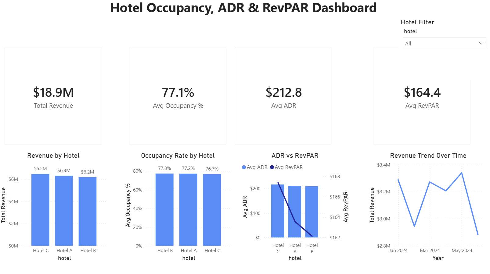
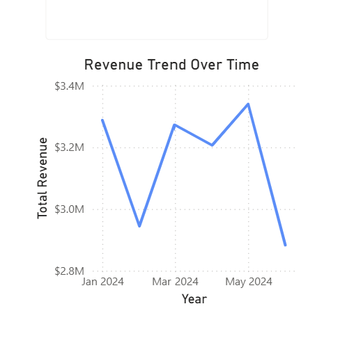
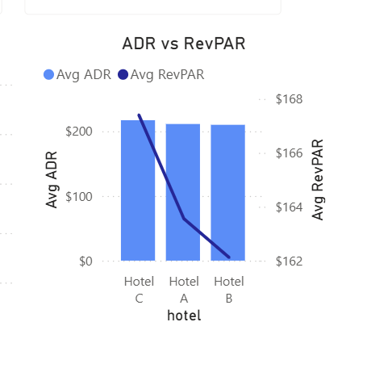

# 🏨 Hotel Occupancy, ADR & RevPAR Analysis

## 🧠 Business Problem

Hotel operators must balance occupancy, pricing strategy, and revenue generation to maximize profitability.

This project analyzes hotel performance using key hospitality KPIs including:
- Occupancy Rate
- ADR (Average Daily Rate)
- RevPAR (Revenue Per Available Room)
- Total Revenue

The goal is to identify which hotel properties generate the strongest operational and financial performance.

---

## ❓ Key Questions

- Which hotel generates the highest total revenue?
- Which property has the strongest occupancy rate?
- How do ADR and RevPAR compare across hotels?
- How does revenue trend over time?
- Which hotel demonstrates the strongest revenue efficiency?

---

## 🛠️ Tools Used

- PostgreSQL
- SQL
- Power BI
- DAX
- Python
- GitHub

---

## 📊 Dashboard Overview



---

## 📈 Revenue Trend Analysis



---

## 📉 ADR vs RevPAR Comparison



---

## 📌 Key Insights

- Hotel C generated the highest total revenue.
- Hotel B achieved the highest occupancy rate.
- ADR and RevPAR trends revealed pricing efficiency differences between hotels.
- Revenue trends highlighted operational fluctuations across the reporting period.
- The dashboard enables interactive hotel-level performance analysis using slicers.

---

## 🧮 Example SQL Analysis

```sql
SELECT
    hotel,
    ROUND(AVG(rooms_sold::numeric / rooms_available) * 100, 2) AS occupancy_rate,
    ROUND(AVG(average_daily_rate), 2) AS avg_adr,
    ROUND(AVG(room_revenue / rooms_available), 2) AS revpar,
    ROUND(SUM(room_revenue), 2) AS total_revenue
FROM p4_hotel_raw
GROUP BY hotel
ORDER BY total_revenue DESC;
```

---

## 📁 Project Structure

```text
04_problem-hotel-occupancy-adr-revpar/
│
├── a_sql/
├── b_powerbi/
├── c_python/
├── data_raw/
├── data_clean/
├── docs/
├── outputs/
└── README.md
```