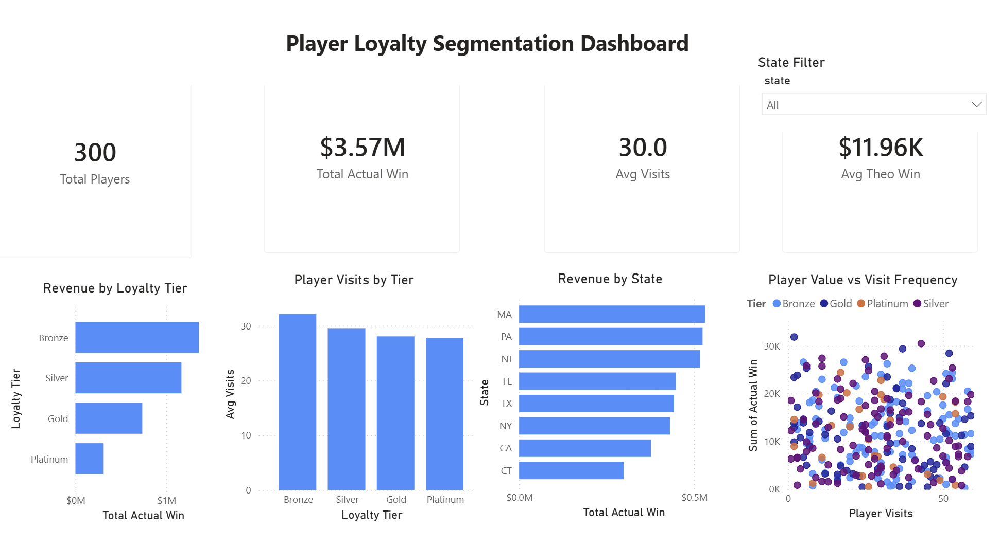

# Player Loyalty Segmentation Dashboard

## Business Problem

Casino and hospitality organizations rely heavily on player loyalty programs to understand customer behavior, maximize revenue, and improve player retention. Leadership teams need visibility into which player segments generate the highest gaming value, how frequently players visit, and which geographic markets contribute the most revenue.

This project simulates a player loyalty analytics environment using SQL, Python, and Power BI to analyze player value segmentation and behavioral trends.

---

## Objective

The objective of this project was to:

- Analyze player loyalty tiers and revenue contribution
- Identify behavioral patterns between visit frequency and gaming value
- Compare player performance across geographic regions
- Build an executive-style Power BI dashboard for operational and customer analytics reporting

---

## Tools Used

- PostgreSQL
- DBeaver
- Python
- Pandas
- Faker
- Power BI
- DAX
- Git & GitHub

---

## Dataset Overview

The dataset contains simulated casino player activity including:

- Player IDs
- Loyalty tiers
- State/region
- Player visit frequency
- Theoretical gaming win
- Actual gaming win

Python was used to generate a realistic synthetic dataset for portfolio development and segmentation analysis.

---

## Key Metrics

The dashboard tracks:

- Total Players
- Total Actual Win
- Average Visits
- Average Theoretical Win

---

## Dashboard Features

### Executive KPI Cards
High-level business metrics for player performance monitoring.

### Loyalty Tier Revenue Analysis
Comparison of gaming revenue contribution by loyalty segment.

### Geographic Revenue Analysis
Breakdown of actual gaming win by state.

### Player Behavioral Segmentation
Scatterplot visualization showing relationships between player visit frequency and gaming value.

### Interactive Filtering
Dynamic state slicer allowing dashboard-level filtering and segmentation.

---

## Business Insights

- Bronze tier players generated the highest overall gaming revenue due to player volume.
- Higher loyalty tiers demonstrated more concentrated player value despite smaller populations.
- Geographic analysis identified top-performing player regions contributing the largest gaming revenue.
- Behavioral segmentation visuals revealed clusters of high-frequency and high-value player activity useful for retention strategy analysis.

---

## Screenshots

---

## Files Included

- SQL table creation scripts
- SQL segmentation analysis queries
- Python dataset generation script
- Raw CSV dataset
- Power BI dashboard (.pbix)
- Dashboard screenshot exports
- Project documentation
