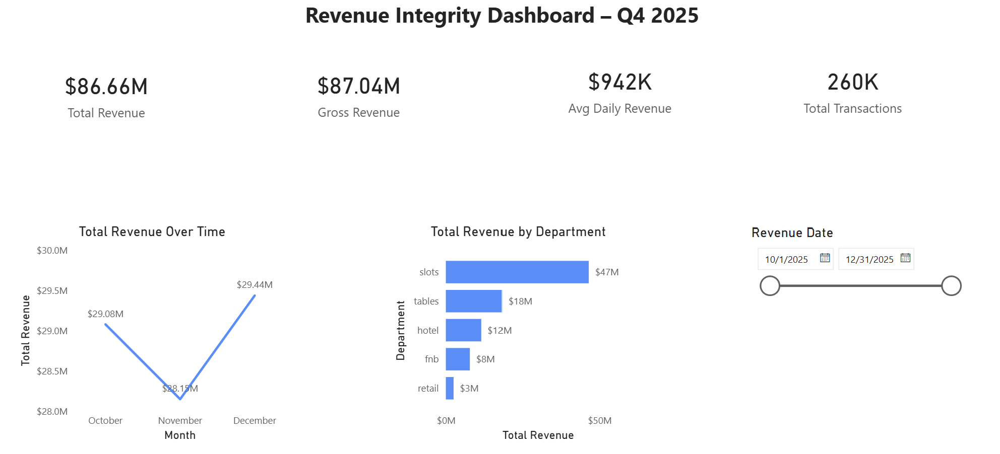

# Chris Duchene

## Financial Analyst | Business Intelligence | Power BI | SQL | Python

[About](#about) • [Technical Skills](#technical-skills) • [Featured Projects](#featured-projects) • [Repository Structure](#repository-structure)

---

I am a Financial Analyst and Business Intelligence professional focused on transforming operational data into actionable business insights.

My work combines SQL, Python, Power BI, and PostgreSQL to solve real-world business problems involving revenue performance, customer behavior, operational efficiency, and executive reporting.

Every project in this portfolio follows an end-to-end analytics workflow that mirrors professional analytics environments.

---

# Technical Skills

- Power BI
- SQL
- PostgreSQL
- Python
- Microsoft Excel
- DAX
- Power Query
- Git & GitHub
- Dashboard Design
- KPI Reporting
- Data Cleaning
- Business Intelligence

---

## Certifications

Microsoft PL-300 Power BI Data Analyst
CompTIA Security+
CompTIA CySA+
CompTIA Network+
CompTIA A+

---

# Featured Projects
---

## 📊 Project 1 — Revenue Integrity Analysis

## 📊 Dashboard Preview



**Business Problem**

Validate daily casino revenue while identifying duplicate transactions, missing reporting days, and reconciliation issues.

**Tools Used**

Power BI • SQL • Python • PostgreSQL

**Key Skills Demonstrated**

- Revenue reconciliation
- Data validation
- KPI dashboard design
- Financial reporting
- Exception analysis

📂 **[View Project 1 →](01_problem-revenue-integrity/)**

---

## 🎯 Project 2 — Promotional Effectiveness Analysis

## 📊 Dashboard Preview


**Business Problem**

Evaluate promotional campaigns to determine which marketing efforts generate the highest return on investment.

**Tools Used**

Power BI • SQL • Python • PostgreSQL

**Key Skills Demonstrated**

- Marketing analytics
- ROI analysis
- Campaign performance
- Executive dashboard reporting

📂 **[View Project 2 →](02_problem-promo-effectiveness/)**

---

## 👥 Project 3 — Labor Efficiency & Cost Analysis

## 📊 Dashboard Preview


**Business Problem**

Analyze staffing efficiency by comparing labor costs against operational volume to identify opportunities for improved productivity.

**Tools Used**

Power BI • SQL • Python • PostgreSQL

**Key Skills Demonstrated**

- Workforce analytics
- Labor cost optimization
- Operational KPI reporting
- Trend analysis

📂 **[View Project 3 →](03_problem-labor-vs-volume/)**

---

## 🏨 Project 4 — Hotel Occupancy, ADR & RevPAR

## 📊 Dashboard Preview


**Business Problem**

Evaluate hotel performance using occupancy rate, Average Daily Rate (ADR), RevPAR, and revenue trends to support operational decision-making.

**Tools Used**

Power BI • SQL • Python • PostgreSQL

**Key Skills Demonstrated**

- Hospitality analytics
- Revenue management
- Occupancy analysis
- Executive dashboard development


📂 **[View Project 4 →](04_problem-hotel-occupancy-adr-revpar/)**

---

## 🎰 Project 5 — Player Loyalty Segmentation

## 📊 Dashboard Preview


**Business Problem**

Analyze player loyalty behavior to identify high-value customer segments and support data-driven marketing strategies.

**Tools Used**

Power BI • SQL • Python • PostgreSQL

**Key Skills Demonstrated**

- Customer segmentation
- Business intelligence
- Loyalty analytics
- Data visualization


📂 **[View Project 5 →](05_problem-player-loyalty-segmentation/)**

---

# Repository Structure

```text
portfolio-data-analytics
│
├── 01_problem-revenue-integrity
├── 02_problem-promo-effectiveness
├── 03_problem-labor-vs-volume
├── 04_problem-hotel-occupancy-adr-revpar
└── 05_problem-player-loyalty-segmentation
```

---

# Analytics Workflow

Every project follows the same professional workflow:

Raw Data

↓

Python (Data Generation & Cleaning)

↓

SQL (Business Queries)

↓

Power BI (Executive Dashboard)

↓

Business Recommendations

---

## Connect With Me

- GitHub: https://github.com/chrisduchene-data
- LinkedIn: https://www.linkedin.com/in/duch-cmd/
